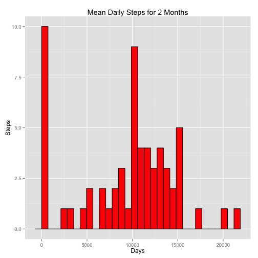
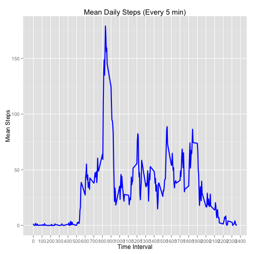
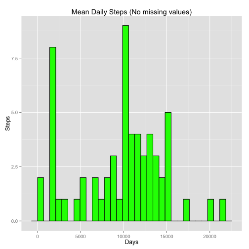
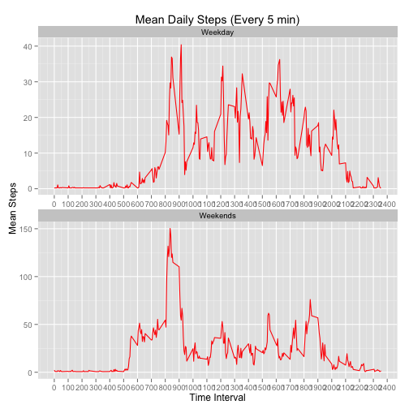

# Coursera's Reproducible Research Peer Assessment 1
## This assignment is done using R's Markdown
### Loading and installing required packages


```r
activity <- read.csv("activity.csv", header = TRUE, stringsAsFactors = FALSE)
library(plyr)
library(ggplot2)
library(knitr)
```

## Introduction

#####      It is now possible to collect a large amount of data about personal movement using activity monitoring devices such as a Fitbit, Nike Fuelband, or Jawbone Up. These type of devices are part of the “quantified self” movement – a group of enthusiasts who take measurements about themselves regularly to improve their health, to find patterns in their behavior, or because they are tech geeks. But these data remain under-utilized both because the raw data are hard to obtain and there is a lack of statistical methods and software for processing and interpreting the data.
#####      This assignment makes use of data from a personal activity monitoring device. This device collects data at 5 minute intervals through out the day. The data consists of two months of data from an anonymous individual collected during the months of October and November, 2012 and include the number of steps taken in 5 minute intervals each day.

## What is mean total number of steps taken per day?
### Prepare the data and plot the histogram ignoring missing values
### The code below can be used to save the graph as plot1, 2, 3, 4 in .png format if needed and print on the screen (default)

```r
activity$steps <- as.numeric(activity$steps)
activity$date <- as.Date(activity$date, "%Y-%m-%d")
sum <- ddply(activity, .(date), summarize, StepsSum = sum(steps, na.rm = TRUE))

#png(file = "plot1.png", bg = "transparent")
p1 <- ggplot(sum, aes(x = StepsSum))
p1 <- p1 + geom_histogram(fill = "red", colour = "black") + labs(title = "Mean Daily Steps for 2 Months", y = "Steps", x = "Days")
p1
```

```
## stat_bin: binwidth defaulted to range/30. Use 'binwidth = x' to adjust this.
```

 

```r
# dev.off()

paste("The Mean of Steps is: ", round(mean(sum$StepsSum, na.rm = TRUE), 3))
```

```
## [1] "The Mean of Steps is:  9354.23"
```

```r
paste("The Median of Steps is: ", round(median(sum$StepsSum, na.rm = TRUE), 3))
```

```
## [1] "The Median of Steps is:  10395"
```
##    Make a time series plot of the 5-minute interval (x-axis) and the average number of steps taken, averaged across all days (y-axis)

```r
# compute number of days, aggregate steps/interval and compute Mean. 
days <- length(unique(activity$date)) 
sum <- ddply(activity, .(interval), summarize, StepsSum = sum(steps, na.rm = TRUE))
sum$meanInterval <- sum$StepsSum / days 

# plot the Mean steps/interval, print and save the plot
# png(file = "plot2.png", bg = "transparent")
p2 <- ggplot(sum, aes(x = interval, y = meanInterval)) + labs(title = "Mean Daily Steps (Every 5 min)", y = "Mean Steps", x = "Time Interval")
p2 <- p2 + geom_line(size = 1, color = "blue", linetype = 1, method = "lm", se = FALSE)
p2 <- p2 + scale_x_continuous(breaks = seq(0, 2400, by = 100))
p2
```

 

```r
# dev.off()

## Find the 5-minute interval that contains the maximum number of steps
paste("Interval containing Maximum Steps is:", round(max(sum$meanInterval), 2))
```

```
## [1] "Interval containing Maximum Steps is: 179.13"
```
## Imputing missing values

#### There are many days/intervals where there are missing values (coded as `NA`). The presence of missing days may introduce bias into some calculations or summaries of the data. To do this, replace all N/As with the daily mean value for that interval. Find the new mean and meadian after filling and then using the filled data set, let's make a histogram of the total number of steps taken each day.

```r
paste("Number of NA's :", sum(is.na(activity$steps)))
```

```
## [1] "Number of NA's : 2304"
```

```r
# Make a copy of original data
newactivity <- activity
newactivity[is.na(activity$steps), ]$steps <- (mean(sum$StepsSum, na.rm = TRUE)/288)
newsum <- ddply(newactivity, .(date), summarize, StepsNewSum = sum(steps))

paste("Number of NA's after substitution is :", sum(is.na(newactivity$steps)))
```

```
## [1] "Number of NA's after substitution is : 0"
```

```r
paste("Mean after filling NAs is", round(mean(newsum$StepsNewSum), 3))
```

```
## [1] "Mean after filling NAs is 9614.069"
```

```r
paste("Median after filling NAs is", round(median(newsum$StepsNewSum), 3))
```

```
## [1] "Median after filling NAs is 10395"
```

```r
# Histogram of the total number of steps taken each day after substitution
# png(file = "plot3.png", bg = "transparent")
p3 <- ggplot(newsum, aes(x = StepsNewSum)) + labs(title = "Mean Daily Steps (No missing values)", y = "Steps", x = "Days") 
p3 <- p3 + geom_histogram(fill = "green", colour = "black")
p3
```

```
## stat_bin: binwidth defaulted to range/30. Use 'binwidth = x' to adjust this.
```

 

```r
# dev.off()
```
## Are there differences in activity patterns between weekdays and weekends?
#### First, let's find the day of the week for each measurement in the dataset. In
this part, we use the dataset with the filled-in values.


```r
str(newactivity)
```

```
## 'data.frame':	17568 obs. of  3 variables:
##  $ steps   : num  6.88 6.88 6.88 6.88 6.88 ...
##  $ date    : Date, format: "2012-10-01" "2012-10-01" ...
##  $ interval: int  0 5 10 15 20 25 30 35 40 45 ...
```

```r
newactivity$Weekday <- as.factor(ifelse(weekdays(newactivity$date) %in% c("Saturday", "Sunday"), "Weekday", "Weekends"))

days <- length(unique(activity$date))
newsum <- ddply(newactivity, .(interval, Weekday), summarize, StepsNewSum = sum(steps, na.rm = TRUE))
newsum$meanInt <- newsum$StepsNewSum / days

# png(file = "plot4.png", bg = "transparent")
p3 <- ggplot(newsum, aes(x = interval, y = meanInt), aspect = 0.5) + labs(title = "Mean Daily Steps (Every 5 min)", y = "Mean Steps", x = "Time Interval")
p3 <- p3 + geom_line(color ="red", aspect = 0.5)
p3 <- p3 + facet_wrap(~ Weekday, ncol=1, scales="free") + scale_x_continuous(breaks = seq(0, 2400, by = 100))
p3
```

 

```r
# dev.off()
```
